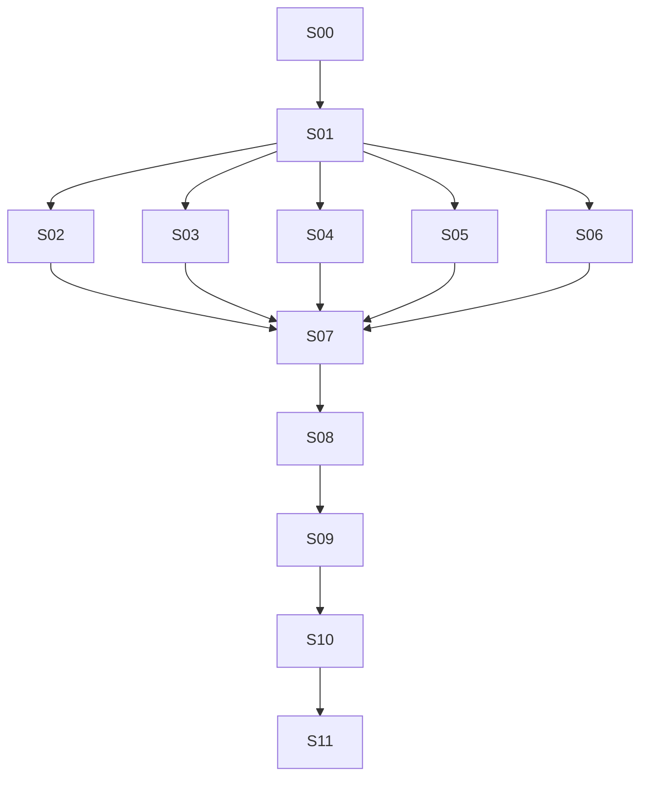

# Plano técnico em slices para agentes

Estado: S00 concluída localmente; S01 pronta para atribuição. A implementação acontece em `/Users/arthur/Documents/ChatGPT/Full Screen Plugin Chrome/youtube-auto-fullscreen`, com Git independente. Cada arquivo Sxx é uma instrução completa que pode ser passada a um agente junto ao checkout correto.

## Resultado e decisões fixas

Extensão Chrome MV3 para Mac e Windows, JavaScript ESM, funções puras no domínio, JSDoc/checkJs, esbuild, Vitest, Playwright, ESLint e Prettier. Tela cheia da janela com player expandido; nenhum clique adicional para entrar. Vídeos e lives incluídos; Shorts excluídos. Esc suprime a entrada para o vídeo atual. Interruptor global persistente. Restaurar somente alterações da extensão. Não ativar aba/janela em segundo plano nem forçar reprodução.

## Mapa de entregas

| Slice                        | Entrega verificável                                            | Dependências |
| ---------------------------- | -------------------------------------------------------------- | ------------ |
| [S00](S00-foundation.md)     | Repositório, build mínimo, testes e CI de base                 | Nenhuma      |
| [S01](S01-contracts.md)      | Contratos executáveis de estado, mensagens e adaptadores       | S00          |
| [S02](S02-domain.md)         | Decisões de entrada, saída e restauração em funções puras      | S01          |
| [S03](S03-chrome.md)         | Adaptadores Chrome testados, sem regras de negócio             | S01          |
| [S04](S04-youtube.md)        | Detecção por eventos e apresentação reversível do player       | S01          |
| [S05](S05-popup.md)          | Popup acessível e preferência global pela interface contratada | S01          |
| [S06](S06-e2e-harness.md)    | Ambiente E2E com extensão carregada e páginas controladas      | S01          |
| [S07](S07-integration.md)    | Primeiro fluxo completo: abrir vídeo → tela cheia → Esc        | S02–S06      |
| [S08](S08-resilience.md)     | Retomada do worker, cancelamento e falhas concorrentes         | S07          |
| [S09](S09-e2e-regression.md) | Matriz funcional E2E e regressões da experiência               | S08          |
| [S10](S10-delivery.md)       | Pacote reproduzível, documentação e CI completos               | S09          |
| [S11](S11-acceptance.md)     | Aceitação no Chrome real em Mac/Windows                        | S10          |

## Ordem e paralelismo

Com três agentes de implementação: após S01, executar S02/S03/S04; quando um deles terminar, atribuir S05 ou S06. S07 só começa quando todos esses resultados estiverem integrados. S08–S11 são sequenciais porque revisam o comportamento conjunto. O paralelismo não exige três agentes: um agente também pode executar na ordem indicada.

Os slices S02–S06 produzem componentes testáveis; a capacidade completa no navegador só é declarada em S07. Essa distinção evita apresentar resultados de mocks como funcionalidade pronta.

## Coordenação e propriedade dos arquivos

- Um responsável integra as entregas e mantém o estado deste quadro. Não delegar duas slices para o mesmo diretório compartilhado sem isolamento.
- Depois do primeiro commit de S00, usar branches/worktrees por slice. Agentes paralelos começam no mesmo commit de contratos S01 e incorporam alterações pela integração, sem editar o checkout uns dos outros.
- S00 controla configurações, dependências, lockfile, manifesto e workflow inicial. Depois, só o integrador altera esses arquivos, salvo propriedade expressa em S10.
- S01 controla `src/shared/` e `docs/contracts.md`. Mudanças posteriores exigem proposta concreta de contrato, atualização pelo integrador e novos testes de compatibilidade; não criar formatos alternativos silenciosamente.
- Cada slice é dona de seus arquivos e de seus testes. Nomes dos testes em inglês, espelhando a camada. S06 é dona das fixtures E2E; outras slices solicitam extensões em vez de editar essas fixtures simultaneamente.
- S07 assume as entradas e a aplicação. S08 assume esses mesmos arquivos somente depois de S07 integrada.
- Ao precisar mudar arquivo fora do escopo: descrever motivo, interface afetada e alteração mínima para o integrador. Continuar o trabalho independente.
- Trabalhar apenas na raiz definitiva. Todos os arquivos de aplicação, testes e documentação de produto serão novos. Levar apenas skills oficiais/licenças e este conjunto de instruções de planejamento.
- Não criar remoto, enviar commits ou publicar pacotes por inferência. A conexão ao GitHub depende da conta, nome e visibilidade escolhidos pelo autor.

## Contratos que S01 precisa resolver antes do paralelismo

1. Identidade: aba, janela, documento atual, vídeo e geração da navegação. IDs de aba/janela vêm do remetente do Chrome, não do payload da página. A geração deve ser estável entre notificações duplicadas e mudar na transição real de vídeo.
2. Mensagens versionadas: anúncio/atualização do player, pedido de saída, leitura/alteração da preferência, comando de apresentação e confirmação. Todas recebem validação de forma, versão, limites e remetente.
3. Transição pura: `transition(state, event) -> { state, effects }`, sem ler DOM, Chrome, tempo ou valores aleatórios.
4. Efeitos: persistir intenção, alterar/restaurar janela, apresentar/restaurar player e confirmar preferência. Eventos de sucesso/falha sempre carregam identidade da operação para descartar respostas antigas.
5. Persistência: preferências versionadas em `storage.local`; estado temporário e operações pendentes em `storage.session`. Não presumir gravação atômica entre as duas áreas.
6. Interfaces: leitura de contexto de aba/janela, alteração de janela, leitura/gravação de sessão/preferência e envio de comandos a documento específico. Registrar retornos e falhas esperadas, não somente nomes.
7. Ciclo de apresentação: `mount`/`apply`/`restore`/`dispose`, idempotentes; `dispose` remove listeners, observers e estilos próprios.
8. Supressão: Esc permanece válido para o vídeo atual durante pausa, anúncio, troca de aba, troca do elemento player, recarga do mesmo vídeo e reinício do worker; uma mudança real de vídeo libera a supressão. Um ciclo A→B→A é uma nova visualização. Reativação explícita pelo popup pode liberar a supressão da aba elegível atual.

S01 pode ajustar nomes para clareza, mantendo essas semânticas e publicando o contrato final para todos os agentes.

## Definition of done comum

- Escopo e critérios da slice concluídos, código revisável e sem TODO de comportamento essencial.
- Unitários Vitest cobrem resultados e falhas relevantes, com mínimo de 90% para linhas, funções, statements e branches, globalmente e por arquivo em todo `src/**/*.js` existente, inclusive arquivos não importados. Integração/E2E não contam nessa cobertura.
- Não criar placeholders de código de produção para etapas futuras: eles contam na cobertura. Não enfraquecer limites, excluir módulos difíceis ou permitir sucesso sem testes.
- Lint, formatação, checkJs, testes pertinentes e build passam. Nos primeiros slices, um comando de suíte ainda inexistente pode falhar explicitamente; ele só entra no agregador obrigatório quando a suíte existir. Nunca substituí-lo por um comando que sempre retorna sucesso.
- O gate de 90% é verificado novamente pelo integrador no checkout combinado, não só nas branches individuais.
- Efeitos têm tratamento de erro; nenhum caminho pode ficar impondo tela cheia após Esc/desligamento.
- Relatórios mostram exatamente o que foi executado. Ambiente ausente é pendência; não é teste aprovado.
- Cada bug encontrado ganha um teste de regressão no componente responsável, dentro da slice ou em follow-up atribuído pelo integrador.

## Como atribuir

Passe o conteúdo completo do arquivo da slice ao agente, junto com o caminho do worktree e o commit-base. O arquivo aponta para os contratos e regras comuns. S00 copia este diretório para a raiz definitiva, permitindo que os demais agentes trabalhem sem depender desta conversa.

Não dispare um agente para uma slice bloqueada por dependência. Não é necessário cada agente criar mais agentes.

## Formato obrigatório da entrega do agente

1. Slice, branch e commit-base utilizados.
2. Resumo do comportamento entregue e arquivos alterados.
3. Comandos executados, resultado e cobertura nos quatro indicadores.
4. Evidência dos critérios de aceite, incluindo testes negativos.
5. Mudanças de contrato/configuração solicitadas e incompatibilidades encontradas.
6. Limitações, pendências e instruções para integrar. Não afirmar que CI remota ou Windows passaram sem execução.

## Quadro de execução

**S00 concluída** em 2026-09-18: veja [validação](../acceptance/S00.md). **S01 pronta para começar**. S02–S11 não iniciadas, aguardando suas dependências. A atribuição continua manual; este quadro não dispara agentes.
